# GAN

<p align="center">
    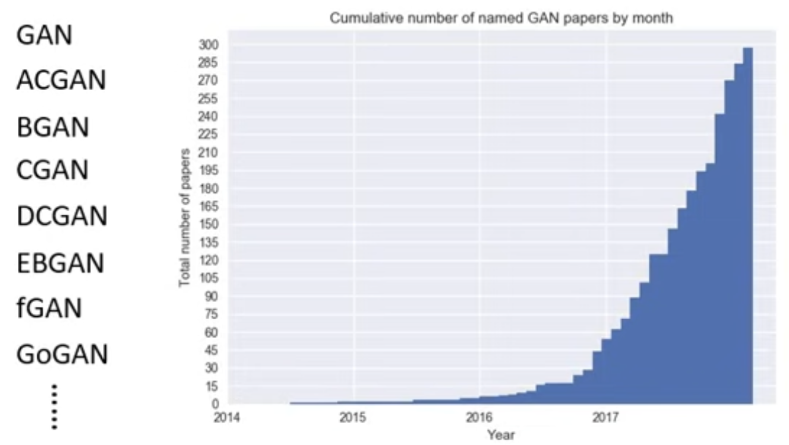
</p>


<p align="center">
    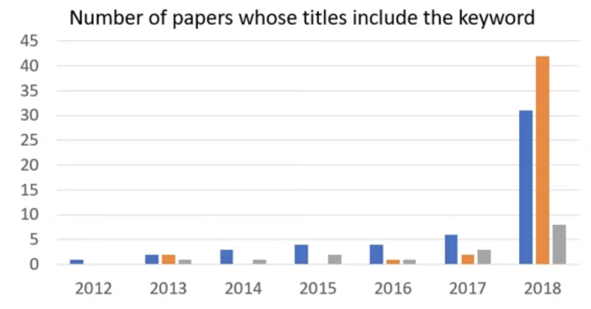
</p>

## What can GAN Do?

<p align="center">
    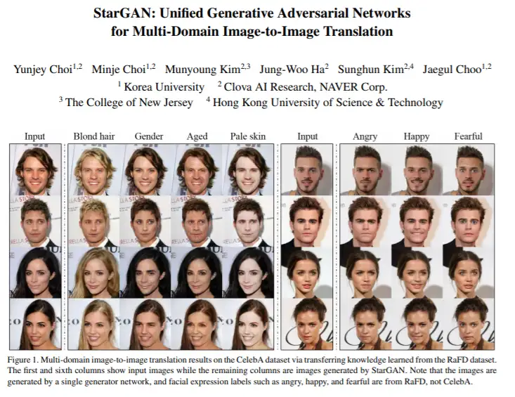
</p>

Choi, Y., Choi, M.-J., Kim, M., Ha, J.-W., Kim, S., & Choo, J. (2017). StarGAN: Unified generative adversarial networks for multi-domain image-to-image translation. CoRR, abs/1711.09020. http://arxiv.org/abs/1711.09020

<p align="center">
    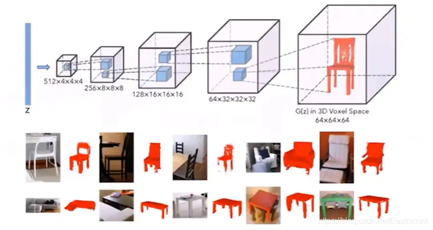
</p>

Wu, J., Zhang, C., Xue, T., Freeman, W. T., & Tenenbaum, J. B. (2016). Learning a probabilistic latent space of object shapes via 3D generative-adversarial modeling. CoRR, abs/1610.07584. Retrieved from http://arxiv.org/abs/1610.07584


## Basic idea of GAN

<p align="center">
    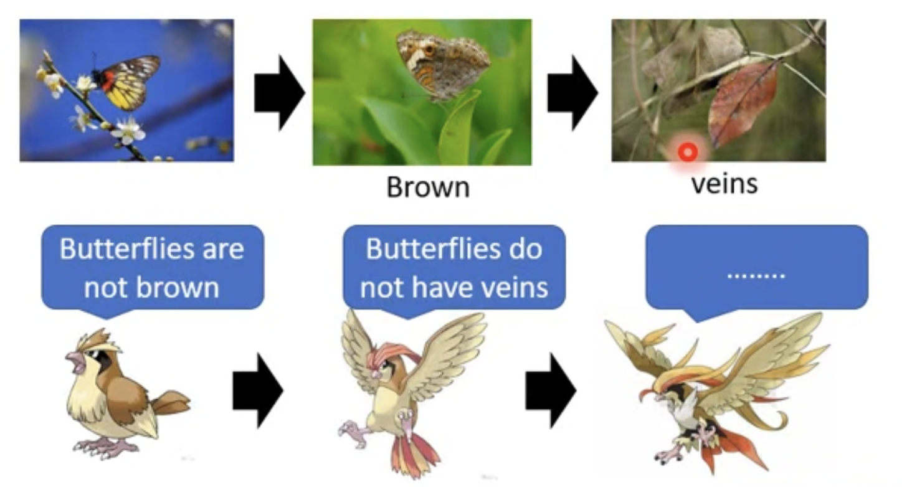
</p>


<p align="center">
    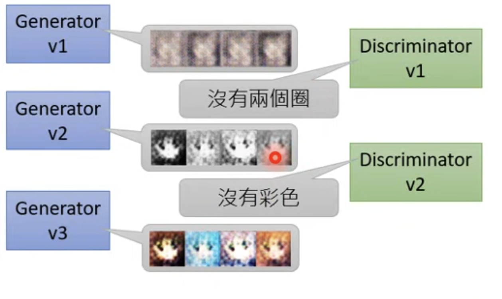
</p>


## Animal Face Generation

**100 updates**

<p align="center">
    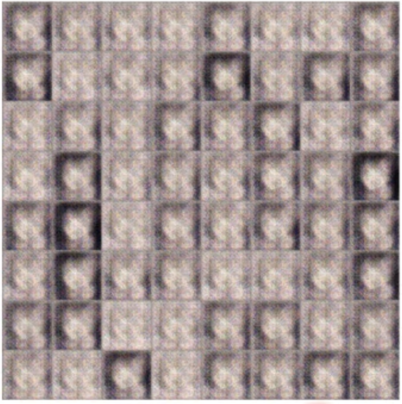
</p>

**1000 updates**

<p align="center">
    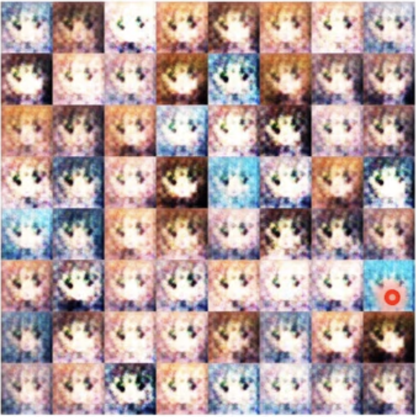
</p>


**5000 updates**

<p align="center">
    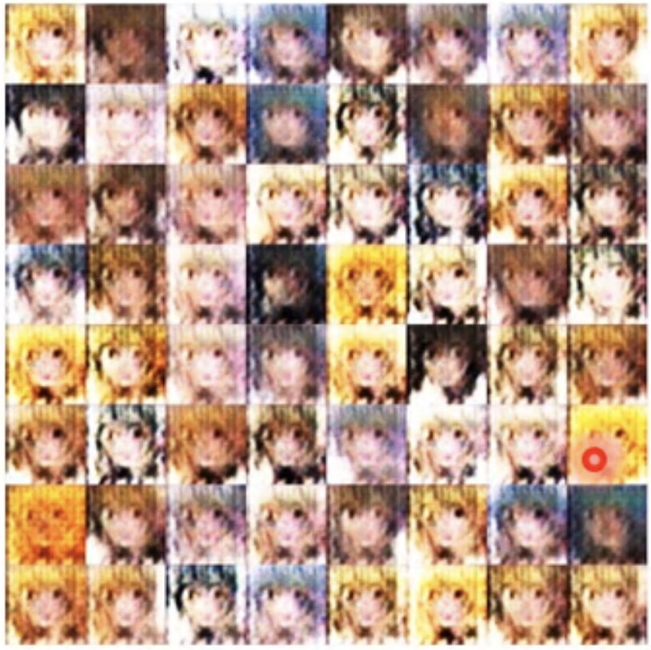
</p>

**10000 updates**
<p align="center">
    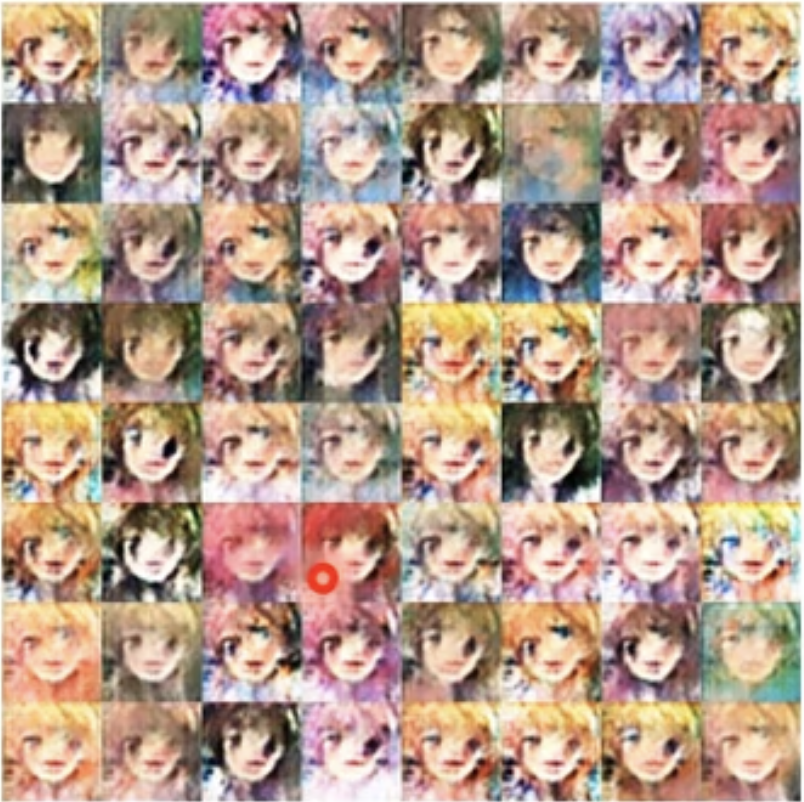
</p>

**20000 updates**

<p align="center">
    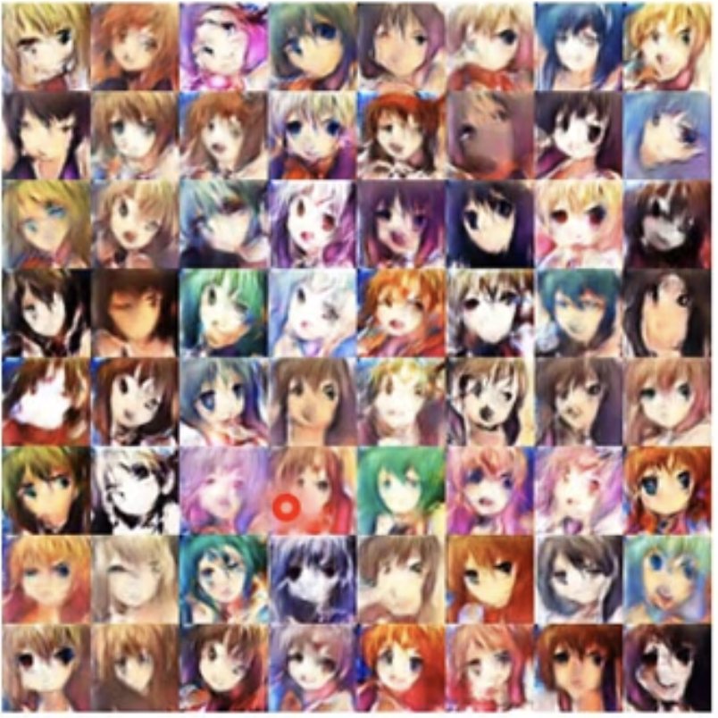
</p>

**50000 updates**

<p align="center">
    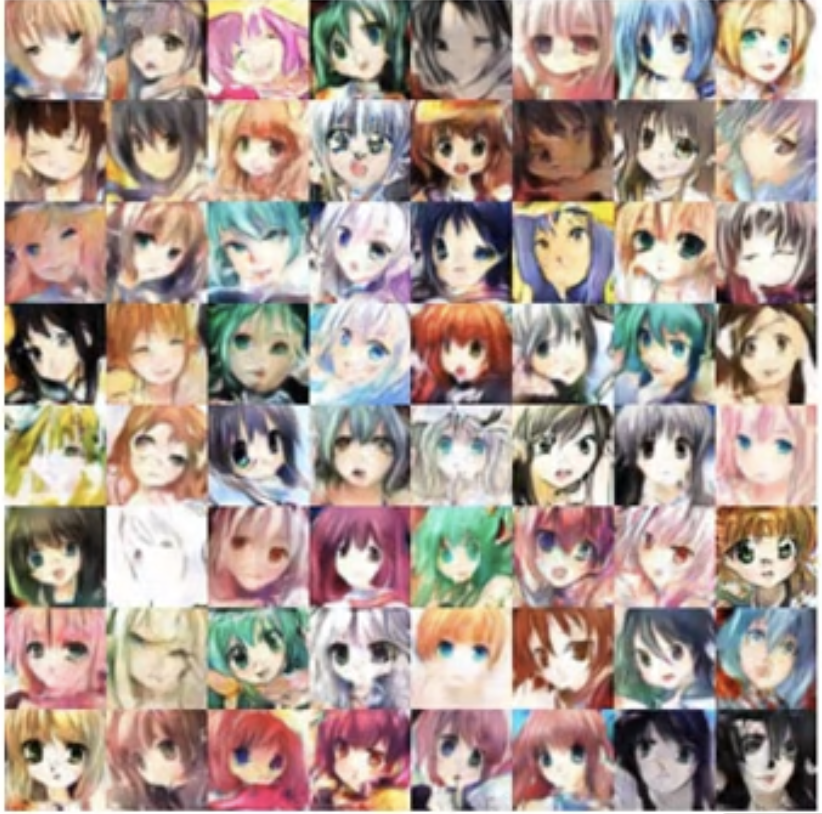
</p>


## GAN Structure

<p align="center">
    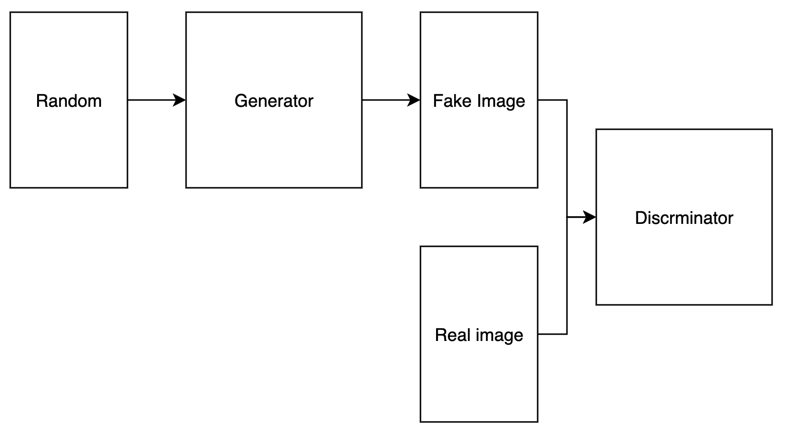
</p>

**训练过程：**
- 从真实数据集中采样m个**真实样本**，假设每个样本的大小为 (3, 32, 32)。
- 生成m个随机噪声样本，假设每个**噪声样本**大小为 （128, 1, 1）。
- 将随机噪声放入**生成器G**中，生成m个生成样本，每个**生成样本**的大小为 (3, 32, 32)。
- 同时将**真实样本**与**生成样本**放入判别器中，判别器需要通过梯度下降（gradient descent）的方法，将自己的权重更新，使得**判别器D**能尽可能的分辨出**真实样本**与**生成样本**。
- 训练K次**判别器D**后，使用较小的学习率来更新一次**生成器G**的参数，

```python
for batch in range(batch_size):)
    步骤一 训练D
    步骤二 训练G
```

<p align="center">
    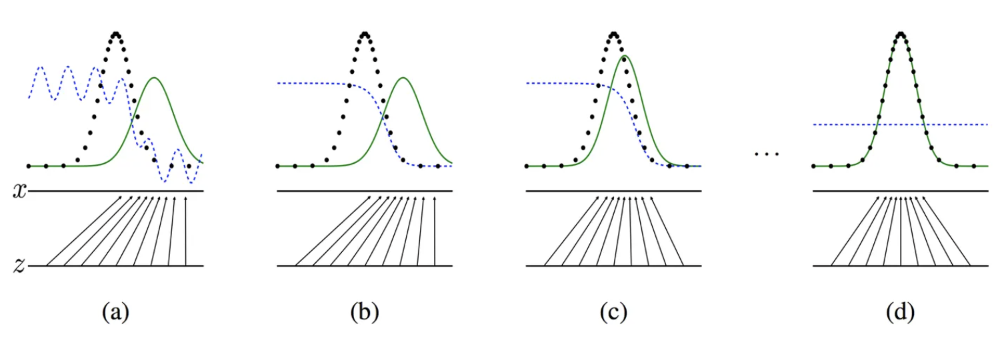
</p>

Goodfellow, I., Pouget-Abadie, J., Mirza, M., Xu, B., Warde-Farley, D., Ozair, S., Courville, A., & Bengio, Y. (2014). Generative Adversarial Nets. In Advances in Neural Information Processing Systems 27 (pp. 2672-2680).


**Question:**
- 什么时候我们认为生成样本是足够好的？
- 理想状况下，判别器判别*真实样本*和*生成样本*的准确率是多少？


**Sample Code**

```python
for epoch in range(num_epochs):
    for images, lables in train_loader:
        real_images = images.to(device)                         # Move the real images to the device (GPU or CPU)
        real_labels = torch.ones(batch_size, 1).to(device)      # Create real labels (1s) with the current batch size
        fake_labels = torch.zeros(batch_size, 1).to(device)     # Create fake labels (0s) with the current batch size

        # --------- Train the Teacher (D) --------- #
        d_optimizer.zero_grad()                                 # Zero the gradients of the Teacher optimizer

        outputs = Teacher(real_images)                          # Pass real images through the Teacher
        d_real_loss = loss_fn(outputs, real_labels)             # Calculate the loss for real images 
                                                                # (how well does it recognize real images)

        z = torch.randn(batch_size, noise_size).to(device)      # Generate random noise to produce fake images

        fake_images = Student(z)                                # Generate fake images from noise
        outputs = Teacher(fake_images.detach())                 # Pass the fake images through the Teacher [1]
        d_fake_loss = loss_fn(outputs, fake_labels)             # Calculate the loss for fake images 
                                                                # (how well does it recognize fake images)

        d_loss = d_real_loss + d_fake_loss                      # Calculate total Teacher loss

        d_loss.backward()                                       # Update Teacher's network weights
        d_optimizer.step()

        # --------- Train the Student (G) --------- #
        g_optimizer.zero_grad()                                 # Zero the gradients of the Student optimizer

        outputs = Teacher(fake_images)                          # Pass the fake images to the Teacher again
        g_loss = loss_fn(outputs, real_labels)                  # Calculate the Student loss 
                                                                # (how well does it fool the Teacher)

        g_loss.backward()                                       # Update Student's network weights
        g_optimizer.step()
```

**Note:**

Why we use `fake_images.detach()` in [1]?

If we do not detach() fake_images, then the update of Teacher will also update the student.


<p align="center">
    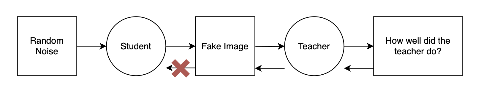
</p>


## Why cannot we use sample Generator?

<p align="center">
    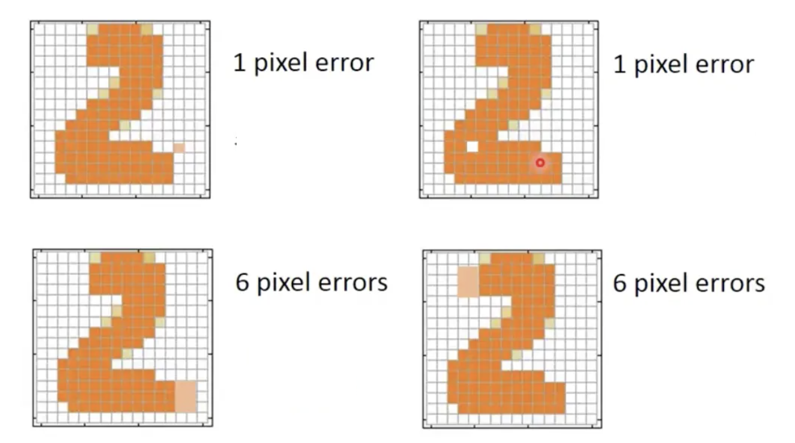
</p>

## GANS

### CGAN

A Conditional Generative Adversarial Network (CGAN) is an extension of the basic Generative Adversarial Network (GAN) framework that allows the generation of synthetic data conditioned on certain inputs. This conditioning can be in the form of labels, tags, or other types of data that direct the generation process, enabling the model to produce more specific or targeted outputs

<p align="center">
    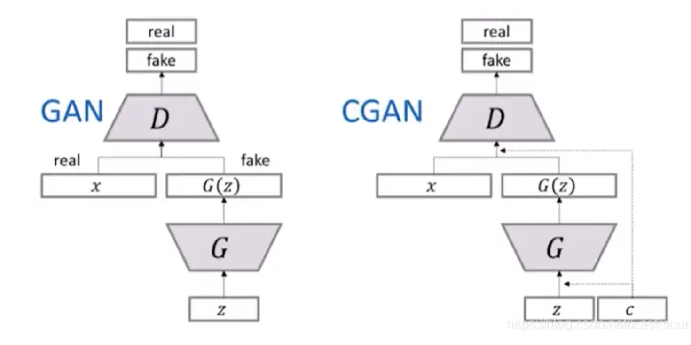
</p>


Mirza, M., & Osindero, S. (2014). Conditional Generative Adversarial Nets. CoRR, abs/1411.1784. http://arxiv.org/abs/1411.1784


Here is an exmaple of Generator and Discrimator on MNIST

```python
class Generator(nn.Module):
    def __init__(self):
        super(Generator, self).__init__()

        self.label_emb = nn.Embedding(num_classes, num_classes)

        self.model = nn.Sequential(
            nn.Linear(latent_dim + num_classes, 256),
            nn.LeakyReLU(0.2, inplace=True),
            nn.Linear(256, 512),
            nn.LeakyReLU(0.2, inplace=True),
            nn.Linear(512, 1024),
            nn.LeakyReLU(0.2, inplace=True),
            nn.Linear(1024, image_size),
            nn.Tanh()
        )

    def forward(self, noise, context):
        noise = noise.view(-1, latent_dim)
        context_feature = self.label_emb(context)
        x = torch.cat([noise, context_feature], 1)

        return self.model(x)


class Discriminator(nn.Module):
    def __init__(self):
        super(Discriminator, self).__init__()

        self.label_emb = nn.Embedding(num_classes, num_classes)

        self.model = nn.Sequential(
            nn.Linear(image_size + num_classes, 1024),
            nn.LeakyReLU(0.2, inplace=True),
            nn.Dropout(0.3),
            nn.Linear(1024, 512),
            nn.LeakyReLU(0.2, inplace=True),
            nn.Dropout(0.3),
            nn.Linear(512, 256),
            nn.LeakyReLU(0.2, inplace=True),
            nn.Dropout(0.3),
            nn.Linear(256, 1),
            nn.Sigmoid()
        )

    def forward(self, img, context):
        img = img.view(-1, image_size)
        context_feature = self.label_emb(context)

        x = torch.cat((img, context_feature), dim=1)
        return self.model(x)
```

### DCGAN


DCGAN 将卷积神经网络和对抗神经网络结合起来的，核心要素是：在不改变GAN原理的情况下提出一些有助于增强稳定性的tricks。

GAN训练时并没有想象的稳定，生成器最后经常产生无意义的输出或奔溃，但是DCGAN按照tricks能生成较好的图像。

<p align="center">
    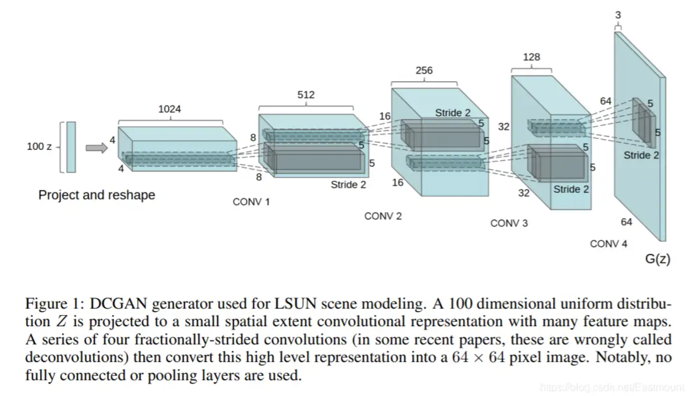
</p>

Radford, A., Metz, L., & Chintala, S. (2015). Unsupervised Representation Learning with Deep Convolutional Generative Adversarial Networks. CoRR, abs/1511.06434. http://arxiv.org/abs/1511.06434


**ConvTranspose2d**

ConvTranspose2d, often called transposed convolution or deconvolution, is the inverse process of the convolution operation and is widely used in image generation tasks such as generative adversarial networks (GANs) and autoencoders. Although it is called deconvolution, it is not the inverse operation of the convolution operation in the strict sense, but a special convolution operation used to increase the spatial size of the input data.


<p align="center">
    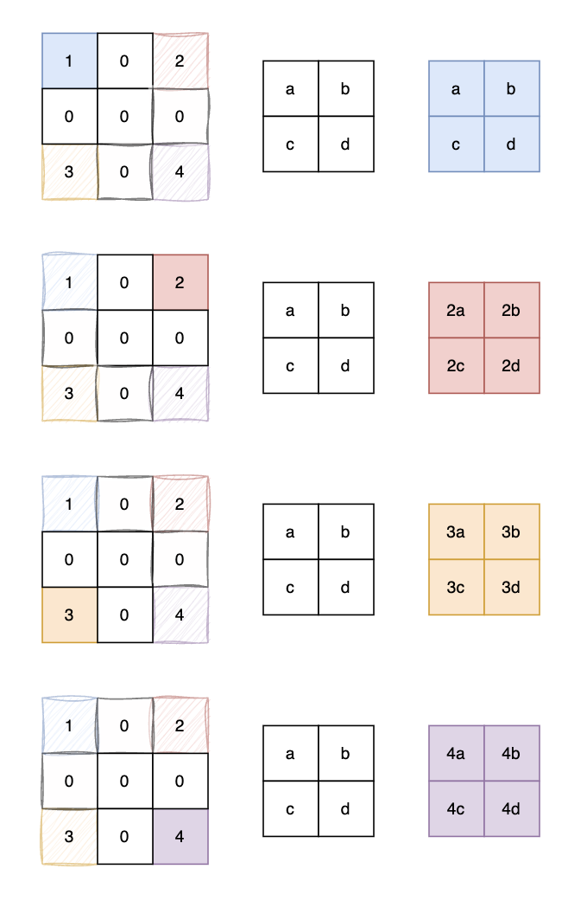
</p>


https://github.com/vdumoulin/conv_arithmetic/blob/master/README.md


### ACGAN

<p align="center">
    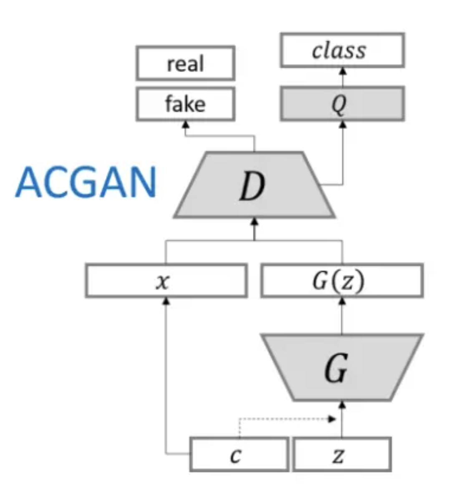
    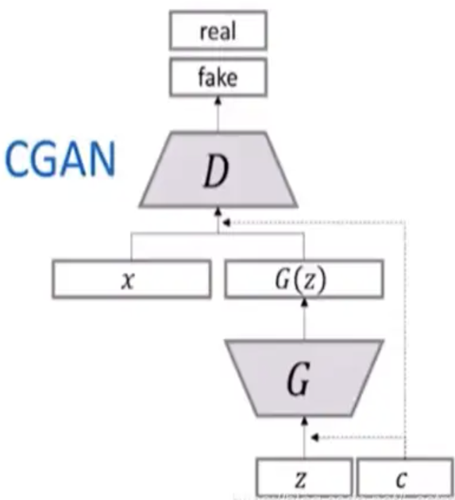
</p>
Odena, A., Olah, C., & Shlens, J. (2017). Conditional Image Synthesis with Auxiliary Classifier GANs. Proceedings of the 34th International Conference on Machine Learning, 70, 2642-2651.


**Purpose:** ACGAN extends the cGAN by adding an auxiliary classifier on top of the discriminator to explicitly classify the output images. This classifier ensures that the generated images not only fool the discriminator in terms of authenticity but are also correctly classified according to the conditioned labels.

**Is ACGAN better?**
- **Quality and Diversity**: ACGAN generally produces higher quality results compared to cGANs because it explicitly optimizes for correct class labeling in addition to the realness of the images. This dual objective helps in better capturing the diversity of characteristics within each class.
- **Stability and Convergence**: The additional classification task in ACGAN can help stabilize the training process, as it provides more structured gradients to both the generator and discriminator. However, this also means ACGAN might be more complex to tune due to its additional loss component


### WGAN


GAN的问题：
- 不一定收敛，学习率不能高，G、D要共同成长，不能其中一个成长的过快
    – 判别器训练得太好，生成器梯度消失，生成器loss降不下去
    – 判别器训练得不好，生成器梯度不准，四处乱跑
- 奔溃的问题，通俗说G找到D的漏洞，每次都生成一样的骗D
- 模型过于自由，不可控

GAN需要重视：稳定（训练不崩）、多样性（样本不能重复）、清晰度（质量好），2014-2017年的很多工作也是解决这三个问题。

为什么GAN存在这些问题，这是因为GAN原论文将GAN目标转换成了KL散度的问题，KL散度就是存在这些坑。

最终导致偏向于生成“稳妥”的样本，如下图所示，目标target是均匀分布的，但最终生成偏稳妥的样本。
- “生成器没能生成真实的样本” 惩罚小
- “生成器生成不真实的样本” 惩罚大


<p align="center">
    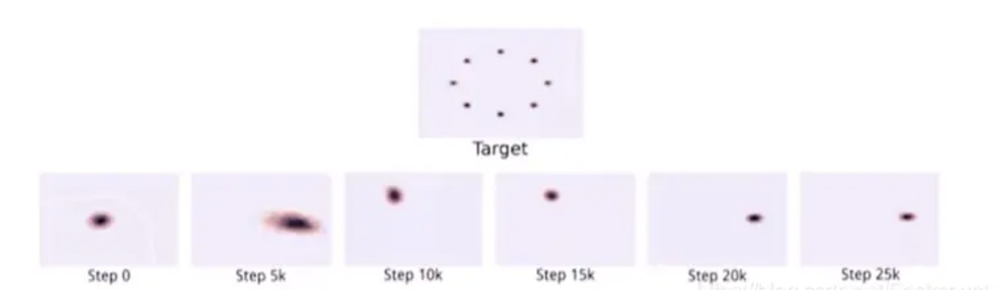
</p>


WGAN（Wasserstein GAN）在2017年被提出，也算是GAN中里程碑式的论文，它从原理上解决了GAN的问题。具体思路为
- 判别器最后一层去掉sigmoid
- 生成器和判别器的loss不取log
- 每次更新判别器的参数之后把它们的绝对值截断到不超过一个固定的常数c
- 不要用基于动量的优化算法（包括Momentum和Adam），推荐使用RMSProp、SGD
- 用Wasserstein距离代替KL散度，训练网络稳定性大大增强，不用拘泥DCGAN的那些策略（tricks）


后续接着改进，提出了WGAN-GP（WGAN with gradient penalty），不截断，只对梯度增加惩罚项生成质量更高的图像。


**upsample**

https://pytorch.org/docs/stable/generated/torch.nn.Upsample.html


