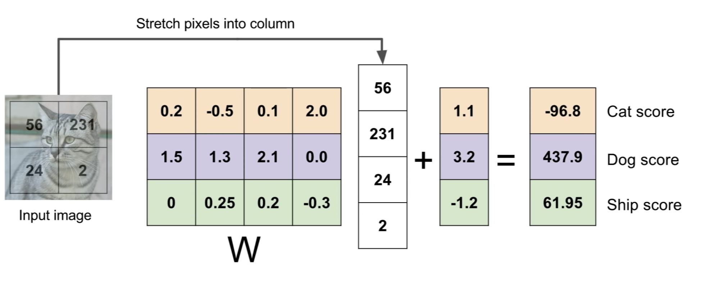
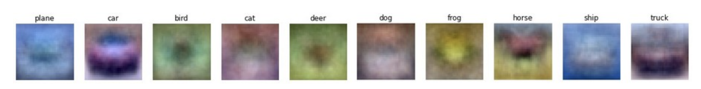
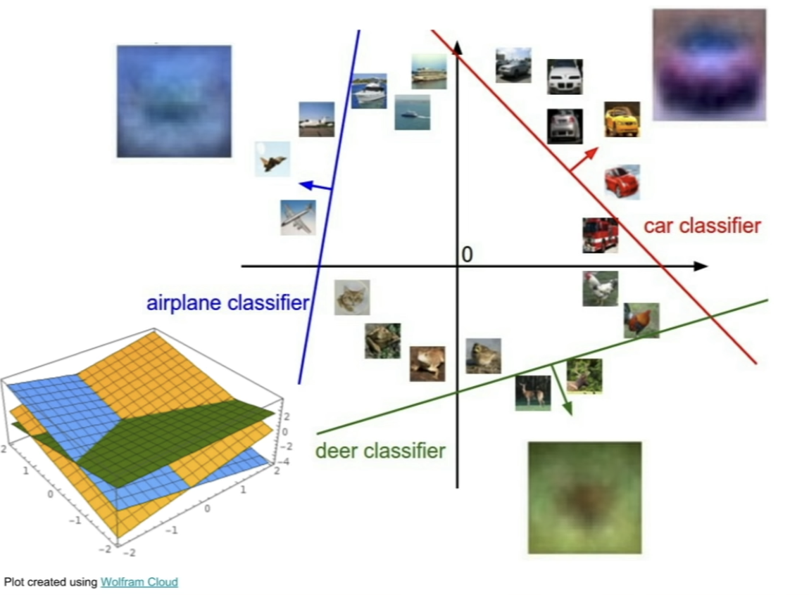
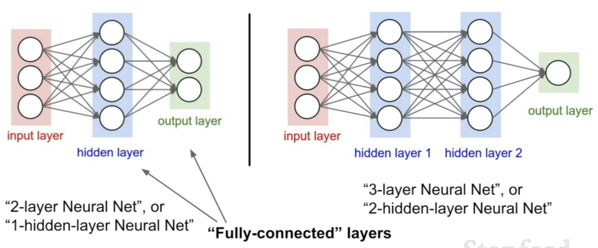
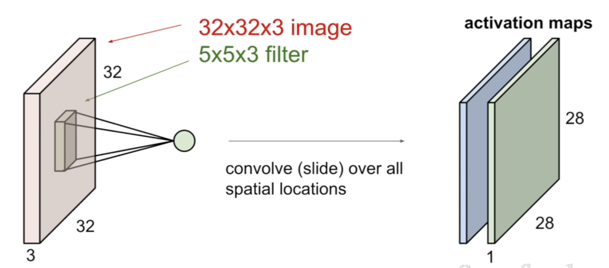
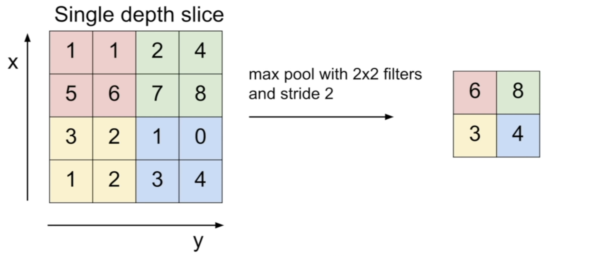
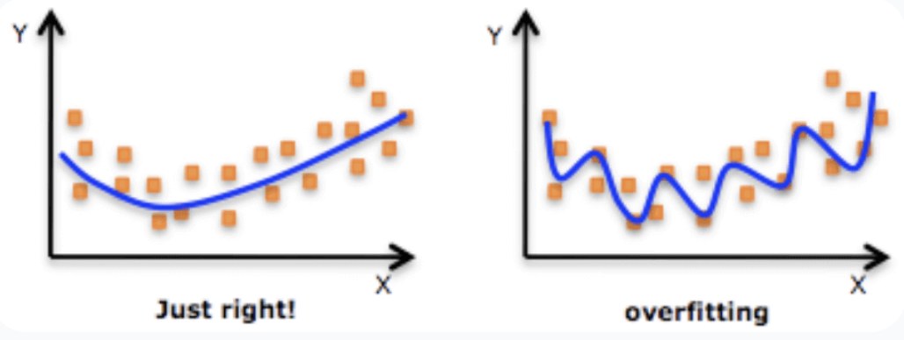
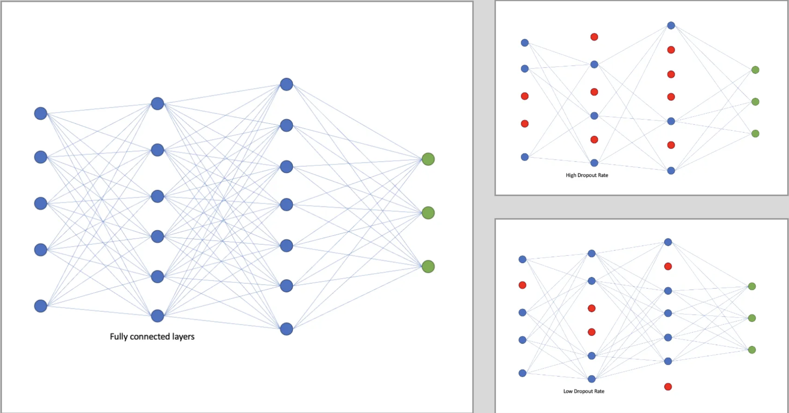
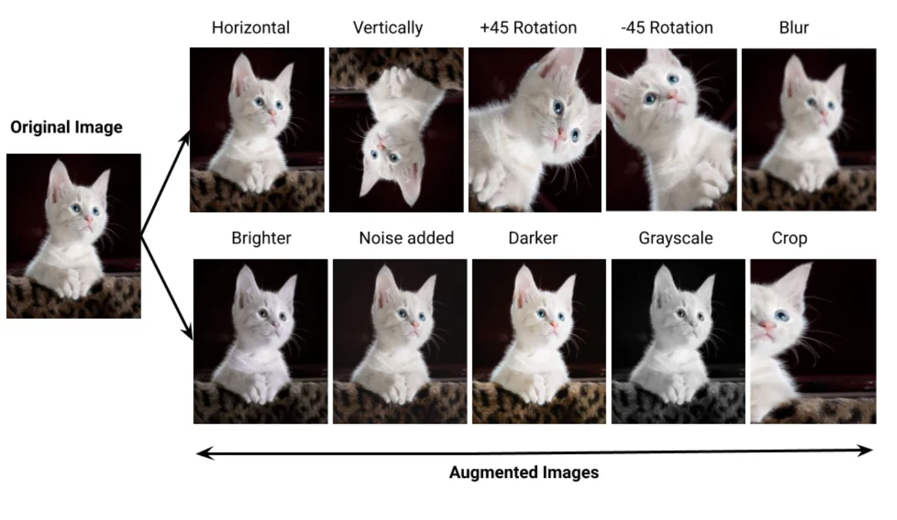

# Image Classification


## Linear Classifier

<p align="center">
    
</p>

**Interpretation of linear classifiers as template matching**

A interpretation for the weights W is that each row of W corresponds to a template for one of the classes

<p align="center">
    
</p>

**Analogy of images as high-dimensional points**. 

Since the images are stretched into high-dimensional column vectors, we can interpret each image as a single point in this space (e.g. each image in CIFAR-10 is a point in 3072-dimensional space of 32x32x3 pixels). Analogously, the entire dataset is a (labeled) set of points.

<p align="center">
    
</p>

## Neural Network

## Multi-Linear Layer

<p align="center">
    
</p>


```python
class Linear(nn.Module):
    def __init__(self):
        super(Linear, self).__init__()
        self.classifier = nn.Sequential(
            nn.Linear (32 * 32 * 3, 1000),          # 3072 -> 1000          /3
            nn.ReLU(inplace=True),
            nn.Linear (1000, 100),                  # 1000 -> 100       /10
            nn.ReLU(inplace=True),
            nn.Linear (100, 10),                    # 100 -> 10         /10
        )
    def forward(self, x):
        x = x.view(-1, 32 * 32 * 3)
        x = self.classifier(x)

        return x
```

Notice that the `ReLU` between each linear layer helps improve accuracy. These `ReLU` activations introduce non-linearity to the model, enabling it to learn more complex patterns in the data.


## Conv Layer

Convolutional layers are responsible for learning spatial hierarchies in the input data. Each convolutional layer applies a set of learnable filters to the input, producing feature maps. These feature maps capture different aspects of the input data.

<p align="center">
    
</p>


## MaxPool Layer

Max-pooling layers are used to downsample the feature maps, reducing their spatial dimensions while retaining important information. Max-pooling helps in achieving translation invariance and reduces computational complexity.

<p align="center">
    
</p>


```python
class VGG(nn.Module):
    def __init__(self):
        super(VGG, self).__init__()
        self.features = nn.Sequential(
            nn.Conv2d(3, 64, kernel_size=3, padding=1),
            nn.ReLU(inplace=True),
            nn.Conv2d(64, 64, kernel_size=3, padding=1),   
            nn.ReLU(inplace=True),
            nn.MaxPool2d(2, 2),                                    

            nn.Conv2d(64, 128, kernel_size=3, padding=1),         
            nn.ReLU(inplace=True),
            nn.Conv2d(128, 128, kernel_size=3, padding=1),       
            nn.ReLU(inplace=True),
            nn.MaxPool2d(2, 2),

            nn.Conv2d(128, 256, kernel_size=3, padding=1),
            nn.ReLU(inplace=True),
            nn.Conv2d(256, 256, kernel_size=3, padding=1),
            nn.ReLU(inplace=True),
            nn.MaxPool2d(2, 2),
        )

        self.classifier = nn.Sequential(
            nn.Linear(4 * 4 * 256, 4096),
            nn.ReLU(inplace=True),
            nn.Linear(4096, 4096),
            nn.ReLU(inplace=True),
            nn.Linear(4096, 512),
            nn.ReLU(inplace=True),
            nn.Linear(512, 10)
        )

    def forward(self, x):
        x = self.features(x)
        x = x.view(-1, 4 * 4 * 256)  # Adjusted for the added depth
        x = self.classifier(x)
        return x
```


**Summary**

- **Filter Size**:
  - A Filter size of 3x3 is commonly used in CNNs, 
  - If we are using big Filter size, will lead to shrink too fast. Shrinking too fast is not good, does not work well.
  - Smaller kernel sizes tend to capture finer details, while larger kernel sizes capture more global features.
- **Padding**:
  - Padding helps in preserving spatial information at the borders of the image. 
  - Without padding, the spatial dimensions would shrink with each convolutional layer.
- **Multiple Convolutions Followed by Max Pooling**:
  - Multiple convolutional layers followed by a max-pooling layer is a common design pattern.
  - Convolutional layers extract features from the input images, while max-pooling layers downsample the feature maps, reducing computational complexity and the spatial dimensions of the feature maps.
  - This pattern helps the model learn hierarchical features by gradually reducing the spatial dimensions while increasing the depth (number of channels) of the feature maps.


# Overfitting

Overfitting occurs when a machine learning model learns to perform exceptionally well on the training data but fails to generalize to unseen or new data.

<p align="center">
    
</p>


## Dropout Layer

Dropout is a regularization technique commonly used in neural networks, especially deep learning models, to **prevent overfitting**.

The idea behind dropout is to randomly "drop out" (i.e., set to zero) a proportion of neurons in the neural network during each training iteration. 

This means that the neurons selected for dropout do not contribute to the forward pass, nor do they participate in the backpropagation of gradients during training.


<p align="center">
    
</p>


```python
self.classifier = nn.Sequential(
    nn.Linear(4 * 4 * 256, 4096),
    nn.ReLU(inplace=True),
    nn.Dropout(0.5),            # <-- used after activation function
    nn.Linear(4096, 4096),
    nn.ReLU(inplace=True),
    nn.Dropout(0.5),
    nn.Linear(4096, 512),
    nn.ReLU(inplace=True),
    nn.Dropout(0.2),
    nn.Linear(512, 10)
)
```

## Data Augmentation

Data augmentation is a technique used to artificially increase the size and diversity of a dataset by applying various transformations to the existing data samples. These transformations include but are not limited to:

- **Geometric transformations**: Such as rotation, translation, scaling, flipping, and cropping.
- **Color transformations**: Such as brightness adjustment, contrast adjustment, hue variation, and saturation adjustment.
- **Noise injection**: Adding random noise to the data, which helps the model become more robust to variations in the input.


<p align="center">
    
</p>


```python
transform = transforms.Compose([
    transforms.RandomHorizontalFlip(p=0.5),
    transforms.ColorJitter(brightness=0.2),
    transforms.RandomRotation(degrees=20),
    transforms.ToTensor(),
    transforms.Normalize((0.5, 0.5, 0.5), (0.5, 0.5, 0.5))
])
```

|Models| Test Accuracy|
|:--|:--:|
|KNN| 22%|
|Linear Model| 40%|
|Linear Model with Relu| 56%|
|Simple Conv | 75%|
|Conv with padding| 78%|
|Conv with Dropout and Data Augmentation| 82%|

# Learning Rate Decay


