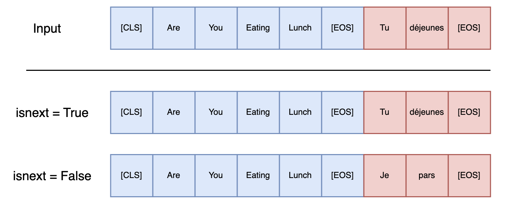
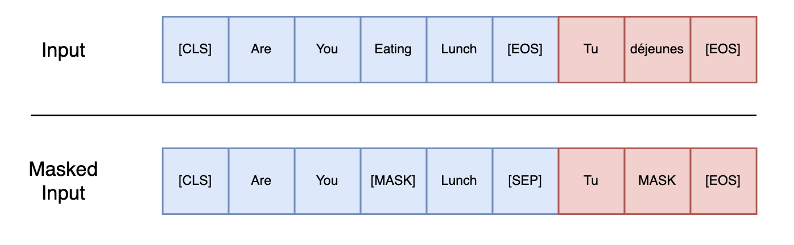
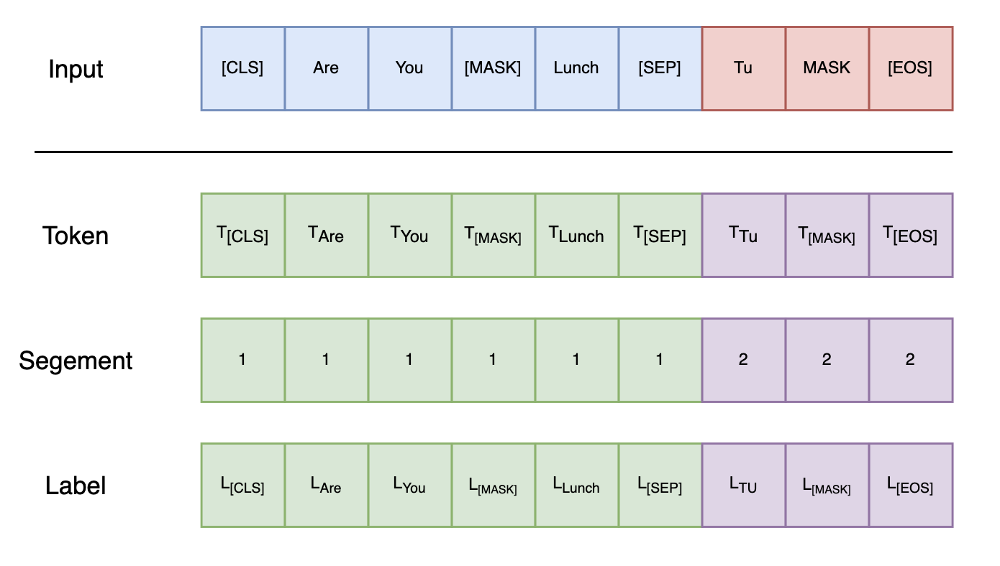
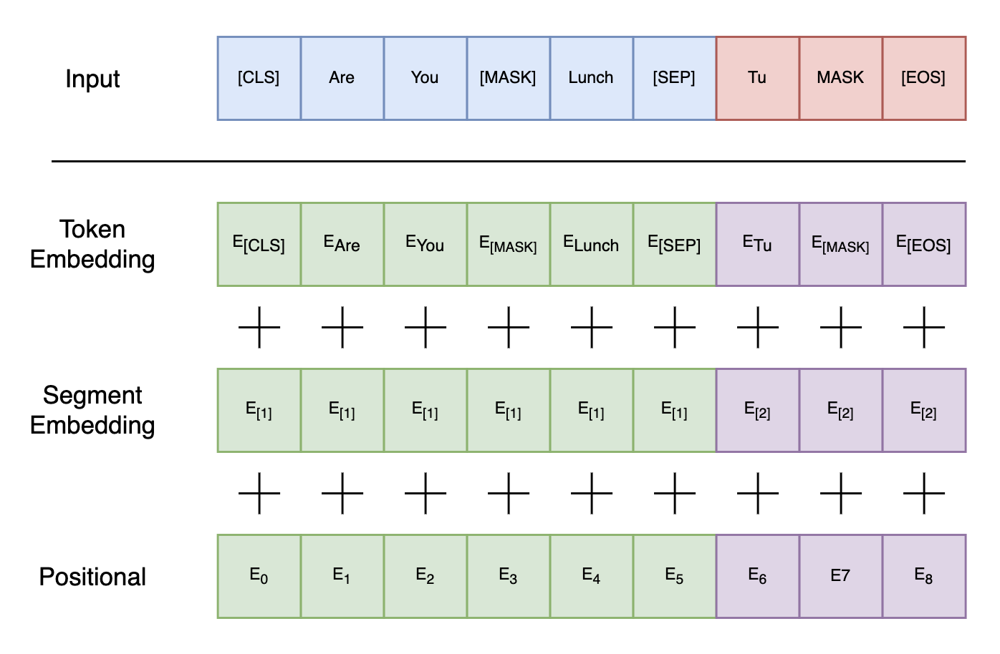
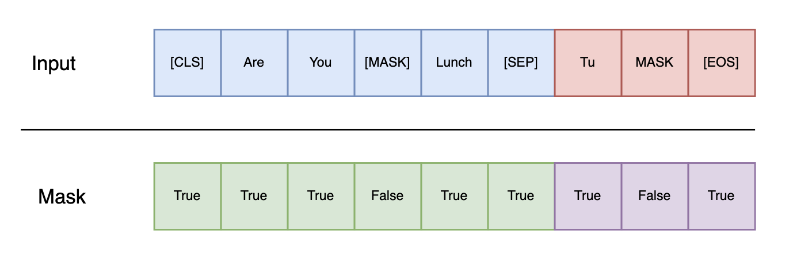
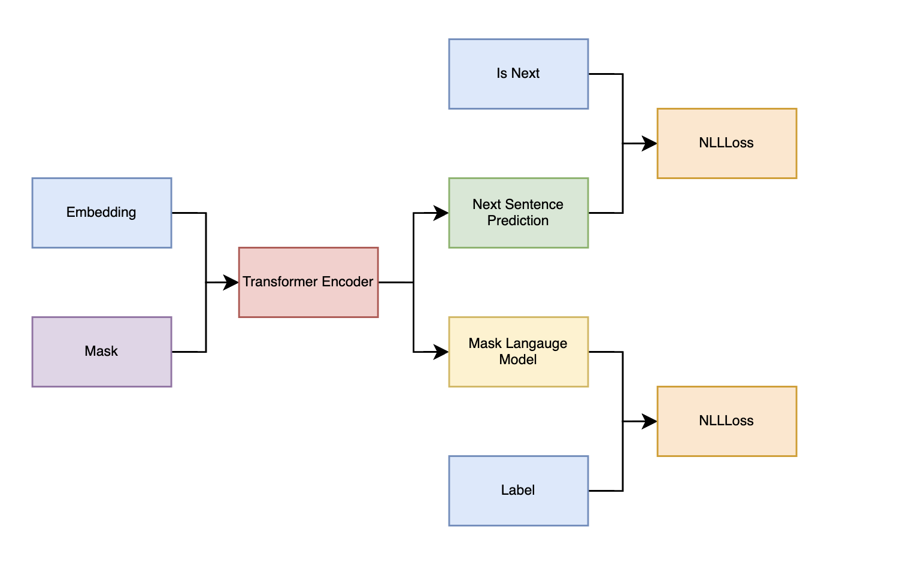

# Bert

## DataSet

为了训练一个理解句子的模型关系，预先训练一个二进制化的下一句测任务。

当选择[A, B (A的翻译)]预训练样本时，
- B有50％的可能是A的翻译, (isnext = True)
- B有50％的可能是来自语料库的随机句子,  (isnext = False)。

    

为了训练一个深度双向表示（deep bidirectional representation），研究团队采用了一种简单的方法，即随机屏蔽（masking）部分输入token，在团队所有实验中，随机地屏蔽了每个序列中15%的WordPiece token。然后只预测那些被屏蔽的token。论文将这个过程称为“masked LM”(MLM)

在这15%的token中，数据生成器将执行以下操作，而不是始终用[MASK]替换所选单词：

- 80％的时间：用[MASK]标记替换单词，例如，my dog is hairy → my dog is [MASK]
- 10％的时间：用一个随机的单词替换该单词，例如，my dog is hairy → my dog is apple
- 10％的时间：保持单词不变，例如，my dog is hairy → my dog is hairy. 这样做的目的是将表示偏向于实际观察到的单词。

    

'

同时
- segment 表示的是每个单词属于哪一句话
- label表示的是（... fill this ...）

    

## Emedding

    

## Mask

The mask is created to specify which elements in the sequence should be ignored during processing by the attention mechanisms in the transformer.

The mask is generated from input by checking which elements are greater than zero (indicating valid tokens as opposed to padding):

    

## Train

    

