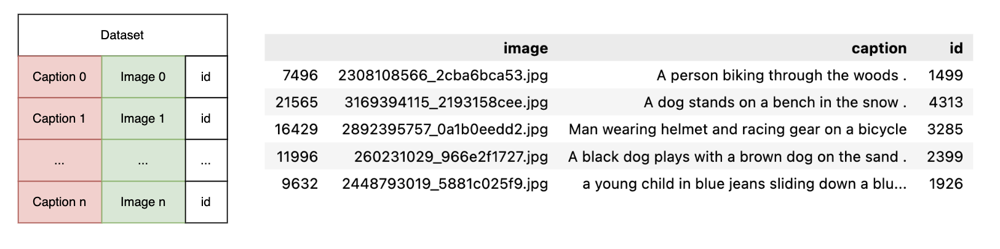
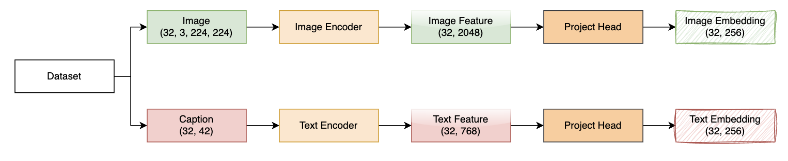
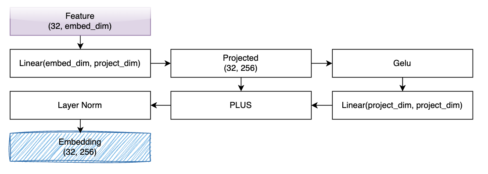
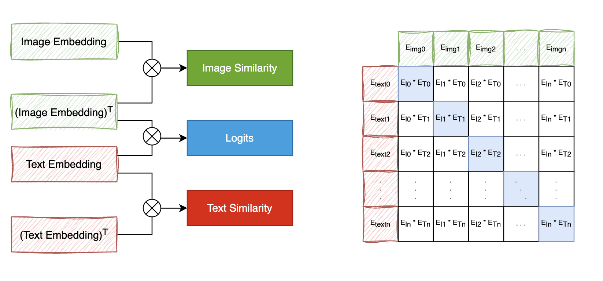
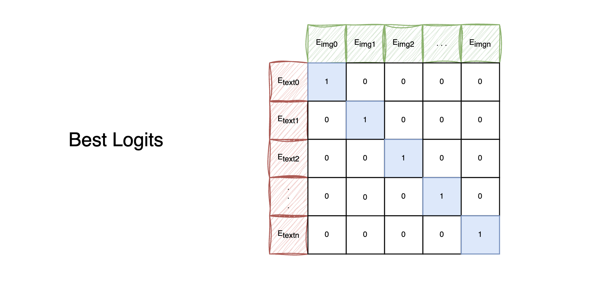
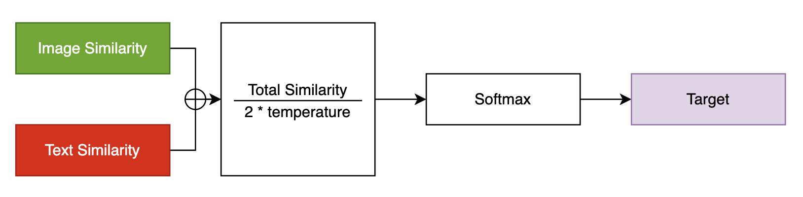
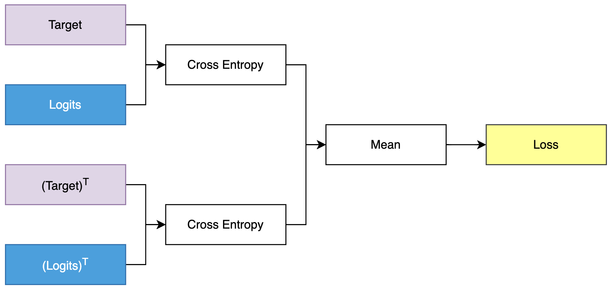

# Clip

[CLIP (Contrastive Language–Image Pre-training)](https://arxiv.org/pdf/2103.00020) is OpenAI's first multimodal pre-training algorithm. The model is a multimodal model that works in parallel with image and text, and constructs the training objective by calculating the similarity of feature vectors from two branches.

OpenAI collected a dataset called WIT (WebImage Text), which comprises over 400 million image-text pairs. In this work, we will use the [Flickr 8k Dataset](https://www.kaggle.com/datasets/adityajn105/flickr8k?resource=download-directory).

## Dataset

<p align="center">
    
</p>

## Embedding
We need to encode both images and their describing texts and embedding them.

<p align="center">
    
</p>

### Image Encoder
Here we will use a `ResNet50` as our image encoder. (You can easily use torchvision library to use ResNets instead of timm.)

```python
class ImageEncoder(nn.Module):
    def __init__(
        self, model_name="resnet50", pretrained=True, trainable=True
    ):
        super().__init__()
        self.model = timm.create_model(
            model_name, pretrained, num_classes=0, global_pool="avg"
        )
        for p in self.model.parameters():
            p.requires_grad = trainable

    def forward(self, x):
        return self.model(x)
```

### Text Encoder

We will use `DistilBERT` model (which is smaller than BERT but performs nearly as well as BERT) from HuggingFace library as our text encoder.

To use `DistilBERT` model, we need to tokenize the sentences (captions) with DistilBERT tokenizer and then feed the token ids (`input_ids`) and the attention masks to `DistilBERT`.

```python
from transformers import DistilBertModel, DistilBertConfig, DistilBertTokenizer

class TextEncoder(nn.Module):
    def __init__(self, model_name="distilbert-base-uncased", pretrained=True, trainable=True):
        super().__init__()
        self.model = DistilBertModel.from_pretrained(model_name)
            
        for p in self.model.parameters():
            p.requires_grad = trainable

        # we are using the CLS token hidden representation as the sentence's embedding
        self.target_token_idx = 0

    def forward(self, input_ids, attention_mask):
        output = self.model(input_ids=input_ids, attention_mask=attention_mask)
        last_hidden_state = output.last_hidden_state
        return last_hidden_state[:, self.target_token_idx, :]
```

### Project Head

Now that we have encoded both our images and texts into fixed size vectors (2048 for image and 768 for text) we need to bring (project) them into a new world (!) with similar dimensions for both images and texts in order to be able to compare them and push apart the non-relevant image and texts and pull together those that match. 

The following will bring the 2048 and 768 dimensional vectors into a 256 (`projection_dim`) dimensional world, where we can compare them.

`embedding_dim` is the size of the input vector (2048 for images and 768 for texts) and `projection_dim` is the the size of the output vector which will be 256 for our case. 

<p align="center">
    
</p>

## Loss Function

### Logits

We want it to learn "similar representations (vectors)" for a given image and the caption describing it.

Meaning that either we give it an image or the text describing it, we want it to produce same 256 sized vectors for both.

<p align="center">
    
</p>

We have `image_embeddings`, a matrix with shape (batch_size, 256) and `text_embeddings` with shape (batch_size, 256). 

with dot product, we can measure how similar two groups of vectors (two matrices) are to each other.

Then we get a matrix with shape (batch_size, batch_size) which we will call `logits`.

```python
def getLogits(image_embeddings, text_embeddings):
    logits = (text_embeddings @ image_embeddings.T) / self.temperature
    return logits
```

`logits`, in the best case, will be a matrix that if we take its softmax, will have `1.0`s in the diagonal:

<p align="center">
    
</p>


### Target

As the loss function's job is to make model's predictions similar to targets (at least in most cases!), we want such a matrix as our target. That's the reason why we are calculating `images_similarity` and `texts_similarity` matrices in the code block below.

(`temperature` is equal to `1.0` in our case, so, it does not make a difference.)

<p align="center">
    
</p>

```python
def get_target(image_embeddings, text_embeddings):
    images_similarity = image_embeddings @ image_embeddings.T
    texts_similarity = text_embeddings @ text_embeddings.T
    targets = F.softmax(
            (images_similarity + texts_similarity) / 2 * self.temperature, dim=-1
        )
    return targets
```

### Loss

<p align="center">
    
</p>

```python
def calLoss(logits, targets)
    texts_loss = cross_entropy(logits, targets, reduction='none')
    images_loss = cross_entropy(logits.T, targets.T, reduction='none')
    loss =  (images_loss + texts_loss) / 2.0 # shape: (batch_size)
    return loss.mean()
```

## Train model

```
python3 Main.py
```


