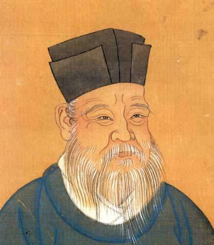
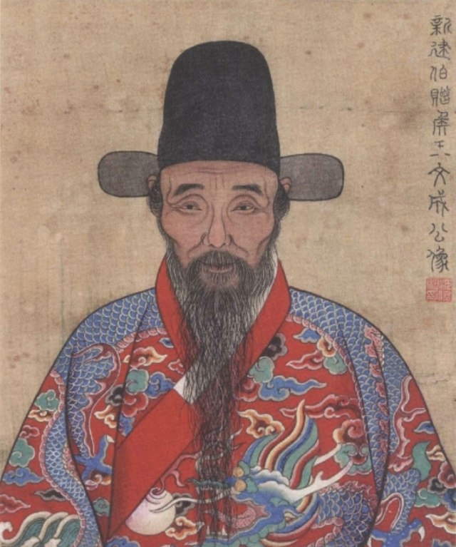

# Bayes

    

## 为什么使用贝叶斯

    
    

## 贝叶斯

    

Thomas Bayes was an English statistician, philosopher and Presbyterian minister who is known for formulating a specific case of the theorem that bears his name: Bayes' theorem. Bayes never published what would become his most famous accomplishment; his notes were edited and published posthumously by Richard Price.

## 贝叶斯算法要解决的问题

正向概率：假设袋子里有N个白球，M个黑球，你伸手摸一个球，是黑球的概率是多大。

逆向概率：假设我们事先不知道袋子里黑球白球的比例，我们摸出几个球出来，观察这些球的颜色之后，我们可以对袋子里面黑球跟白球的比例做出推测。

