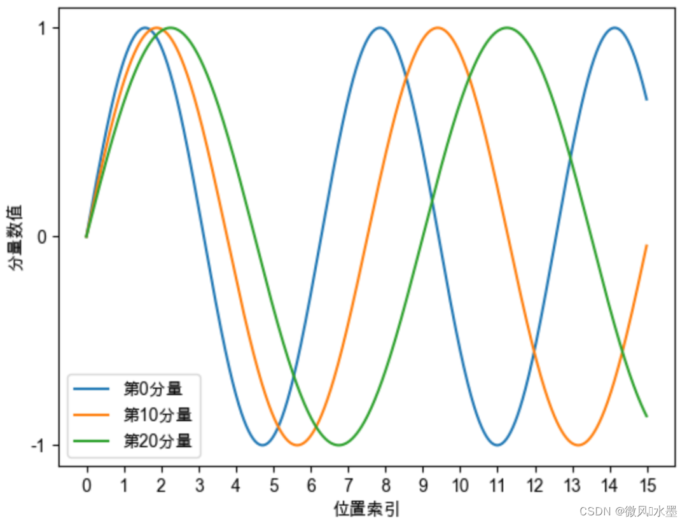
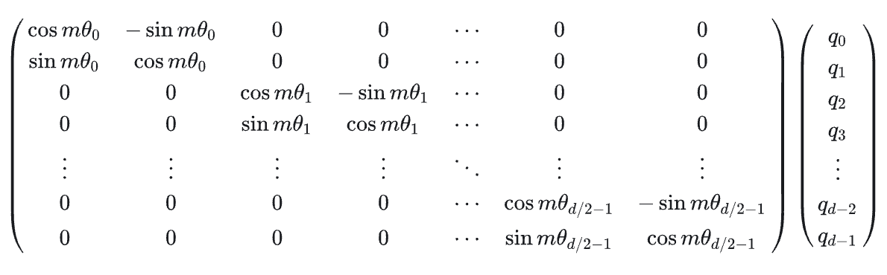

# Positional Encoder

## Why need positional Encoder

目标：对于两个词向量，我们希望

- 距离较近，注意力权重更大
- 距离较远，注意力权重更小。

为了解决这个问题，引入位置编码，让每个词向量都能够感知到它在输入序列中所处的位置信息

$$q_m = f(q, m)$$

$$k_n = f(k, n)$$

那么 $q_m$, $k_n$ 之间的注意力权重为：

$$Attention(m,n) = \frac{exp(\frac{f(q, m)^Tf(k,n)}{\sqrt d})}{ \sum_{j = 1}^N exp (\frac{f(q, m)^Tf(k,j)}{\sqrt d})}$$

## 绝对位置编码

### 训练式位置编码

训练式位置编码广泛应用于早期的transformer类型的模型，如BERT、GPT、ALBERT等

**每个位置的位置向量会随着模型一起训练**。假设模型最大输入长度为512，向量维度为768，我们可初始化一个512*768的位置编码矩阵，该矩阵将参与模型的训练，从而学习得到每个位置所对应的向量表示。

**缺点：**
- 模型不具有长度外推性， 若对其进行扩展，将会破坏模型在预训练阶段学习到的位置信息

### Sinusoidal位置编码

Sinusoidal位置编码的每个分量都是正弦或余弦函数，所有每个分量的数值都具有周期性。

**Sinusoidal位置编码的数学公式：**

对于位置 $pos$ 和维度 $i$，位置编码的计算公式为：

$$PE_{(pos, 2i)} = sin(\frac{pos}{10000^{2i/d_{model}}})$$

$$PE_{(pos, 2i+1)} = cos(\frac{pos}{10000^{2i/d_{model}}})$$

其中 $d_{model}$ 是模型的维度。

如下图所示，每个分量都具有周期性，并且越靠后的分量，波长越长，频率越低。

    

Sinusoidal位置编码还具有远程衰减的性质，具体表现为：对于两个相同的词向量，如果它们之间的距离越近，则他们的内积分数越高。

#### Example:

假设有两个相同的词向量 $x_0 = x_1 = [1, 1, 1, 1, 1, 1]$，分别位于位置0和位置1。

**添加位置编码后**

位置0的词向量：

$$\hat{x}_0 = x_0 + PE_0 = [1, 1, 1, 1, 1, 1] + [0, 1, 0, 1, 0, 1] = [1, 2, 1, 2, 1, 2]$$

位置1的词向量：

$$\hat{x}_1 = x_1 + PE_1 = [1.841, 1.540, 1.046, 1.999, 1.002, 2.000]$$

位置2的词向量：

$$\hat{x}_2 = x_2 + PE_2  ≈ [1.909, 0.584, 1.093, 1.996, 1.004, 2.000]$$

如果query和key由 $\hat{x}$ 经过线性变换得到，那么位置0和位置1之间的attention score与 $\hat{x}_0 \cdot \hat{x}_1$ 相关。

**计算位置0和位置1的Attention Score**

计算点积：
$$\hat{x}_0 \cdot \hat{x}_1 = 14.967$$

**计算位置0和位置2的Attention Score：**

计算点积：
$$\hat{x}_0 \cdot \hat{x}_2 = 13.166$$

**Summary**

- 位置0和位置1的点积（14.967）> 位置0和位置2的点积（13.166）
- 这说明**位置编码使得距离较近的词对具有更高的点积分数**，从而在softmax后产生更大的attention权重
- Sinusoidal位置编码的数学性质（三角函数的和差化积公式）使得位置差为 $\Delta = m-n$ 的两个位置的内积只依赖于 $\Delta$，具有平移不变性，且当 $\Delta$ 增大时，内积会衰减

## RoPE 位置编码

在绝对位置编码中，尤其是在训练式位置编码中，模型只能感知到每个词向量所处的绝对位置，并无法感知两两词向量之间的相对位置。对于Sinusoidal位置编码而言，这一点得到了缓解，模型一定程度上能够感知相对位置。

回看我们求解得到的位置编码函数 $f(q, m)$，可以发现一个非常优美的结果：  

$$q_m = f(q, m) = R_m q = \begin{pmatrix}
\cos(m\theta) & \sin(m\theta) \\
-\sin(m\theta) & \cos(m\theta)
\end{pmatrix} q$$

该函数本质上是一个**向量旋转函数**。

其中，$R_m$ 是一个旋转矩阵，$f(q, m)$ 表示在保持向量 $q$ 的模长不变的同时，将其逆时针旋转 $m\theta$。

### 点积展开推导（二维情况）

从点积开始推导：

$$
\begin{aligned}
q_m \cdot k_n
&= (R_m q)^T (R_n k) \\
&= q^T R_m^T R_n k
\end{aligned}
$$

二维旋转矩阵定义为：

$$
R_m =
\begin{pmatrix}
\cos(m\theta) & -\sin(m\theta) \\
\sin(m\theta) & \cos(m\theta)
\end{pmatrix}
$$

代入后：

$$
q^T
\begin{pmatrix}
\cos(m\theta) & \sin(m\theta) \\
-\sin(m\theta) & \cos(m\theta)
\end{pmatrix}
\begin{pmatrix}
\cos(n\theta) & -\sin(n\theta) \\
\sin(n\theta) & \cos(n\theta)
\end{pmatrix}
k
$$

矩阵相乘得到：

$$
q^T
\begin{pmatrix}
\cos(n\theta)\cos(m\theta) + \sin(n\theta)\sin(m\theta) &
\sin(m\theta)\cos(n\theta) - \sin(n\theta)\cos(m\theta) \\
\sin(n\theta)\cos(m\theta) - \sin(m\theta)\cos(n\theta) &
\cos(n\theta)\cos(m\theta) + \sin(n\theta)\sin(m\theta)
\end{pmatrix}
k
$$

利用三角恒等式：

$$
\cos(n\theta)\cos(m\theta) + \sin(n\theta)\sin(m\theta)
= \cos((n - m)\theta)
$$

$$
\sin(n\theta)\cos(m\theta) - \sin(m\theta)\cos(n\theta)
= \sin((n - m)\theta)
$$

最终得到：

$$
q_m \cdot k_n = q^T
\begin{pmatrix}
\cos((n - m)\theta) & -\sin((n - m)\theta) \\
\sin((n - m)\theta) & \cos((n - m)\theta)
\end{pmatrix}
k
$$

即：

$$
q_m \cdot k_n = q^T R_{n - m} k
$$

### 多维情况

借鉴Sinusoidal位置编码，我们可以将每个分组的$\theta$设为不同的常量，从而引入远程衰减的性质。这里作者直接沿用了Sinusoidal位置编码的设置, $\theta_i = 10000^{\frac{-2i}{d}}$则我们可以将高维向量的旋转矩阵更新为如下

    

### 总结
虽然 RoPE 对每个向量编码的是绝对位置 $m$ 和 $n$，但在 attention 的点积中，绝对位置被完全消除，只剩下相对位置 $m - n$。

$$
q^T R_{n - m} k = ||q||||k|| cos (\phi)
$$

也就意味着越近的会越大，越远的会越小，这样模型自然学到，默认关注近的，除非远的真的很重要

